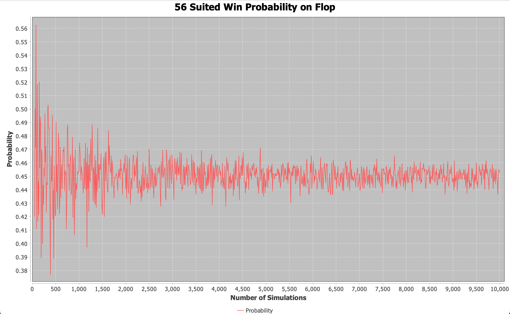
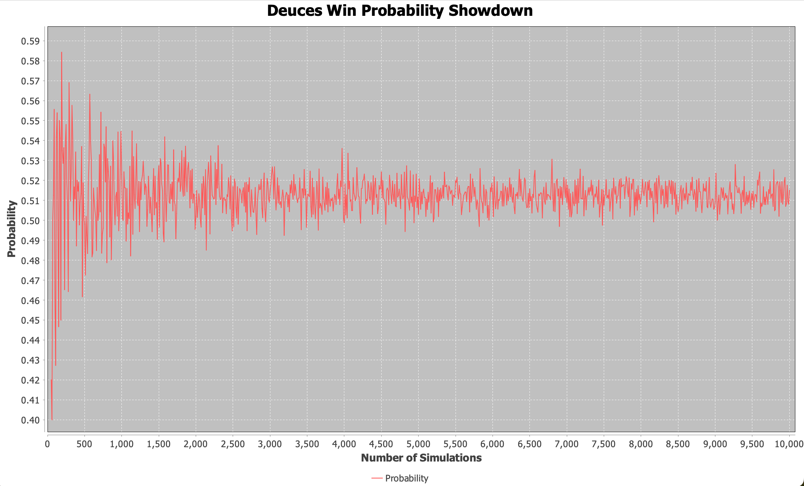
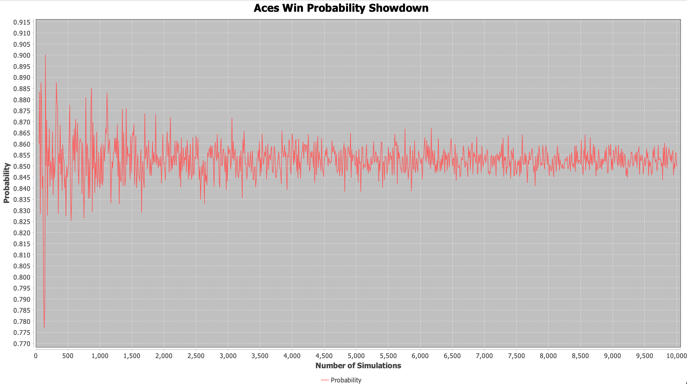
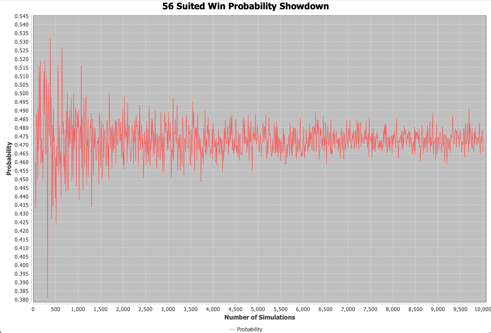

# GTO Poker Set Mining Analytics

I have been interested in poker theory for a little while now, so I thought I might as well try and create something related to Poker. For now, I am specifically looking into
a Texas Hold'em Poker variation, *Heads-Up Hold'em*. I am working my way towards setting up a GTO simulator specifically looking at preflop heads-up and when either of the players are dealt pocket pairs.

## JFreeChart and Monte Carlo Simuluations

To test out JFreeChart and how I want to run simulations, I created a couple charts:

These charts are simply simulating the probability of being dealt a certain kind of hand. For example, if we look at the ***Pocket Pair Probability Chart***, 
the **x-axis** represents the number of simulations I ran while the **y-axis** represents the probability of being dealt a pocket pair. For instance, 
one simulation means I dealt a hand of two cards and then using some predicate (in this case, card rank equality), I kept track of whether we got a pocket pair. 
Then, probability is simply $\frac{\text{num pocket pairs}}{\text{num simulations}}$. This exact process was also used for the ***Suited Pair Probability Chart***.

Obviously, these are things we can prove mathematically without the use of simulations. It is, however, a pretty cool example of the central limit theorem and may be
helpful to statistics students who like poker[^1]. Also, JFreeChart and my current structure for simulations has been working decent, so I am planning on following a similar
pattern for future additions[^2].

## Flop Analysis Against Unrestricted Range

In this simulation, I analyzed how a certain hand plays against an unrestricted range on the flop. In this example, the small blind was dealt pocket deuces (pocket twos), and the big blind was given a random hand (with an unrestricted range).  A flop consisting of three cards was randomly dealt, and the small blind and big blind hands were simply the two cards in their hand, plus the three community cards on the board. This simulation was relatively easy to set up and run because there is only one combination of possible hands, namely because $\binom{N}{k} = \binom{\text{num hole cards } + \text{ num cards on board}}{5} = \binom{2 + 3}{5} = 1$. On the turn each player has $\binom{N}{k} = \binom{2 + 4}{5} = 6$ combinations of possible hands. On the river each player has $\binom{N}{k} = \binom{2 + 5}{5} = 21$ combinations of possible hands. This makes simulating entire games where there are 21 combinations of possible hands for each player quite tedious. I am still trying to figure out an efficient way to do this. However, because determining which player is winning on the flop is the simple calculation of who has the better five-player hand, I was able to simulate this scenario 10,000 times. It seems like pocket deuces are winning around **~66.5%** of the time.

It seems like pocket aces are winning around **~95.5%** of the time on the flop against an unrestricted range (random hand). However, it is important to note that this probabiity vastly overestimates the equity[^3] pocket aces really have against a random hand preflop. For this we will need to simulate the entire game, not just to the flop. Conversely, draw heavy hands (e.g., suited hands, connectors) will have their preflop equities underestimated using this flop analysis method.

It will be useful to use the hand **56 suited** to see how you can easily overvalue pocket pairs and undervalue draw heavy hands on the flop if you are not thinking in terms of equity. On the flop it seems like 56 suited is winning **~45%** of the time against an unrestricted range.

## Preflop Hand Equities

[^1]: For reference, the true probability of pocket pairs is 0.0588 and the true probability of suited pairs is 0.2353.
[^2]: Future additions includes the implementation of full game simulations as well as the implementation of counterfactual regret minimization among other useful metrics.
[^3]: Equity refers to the probability you are to win at showdown (i.e., how often a hand wins after all five community cards are dealt). If you are trying to figure out your equity on the flop, you need to make an educated guess on the strength of your opponents hand, and then calculate how many outs you have. You will then need to estimate how often those outs will appear on the turn and/or river. This is understandably quite hard to do, which is why we have computers.
